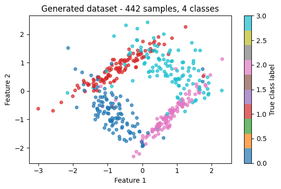
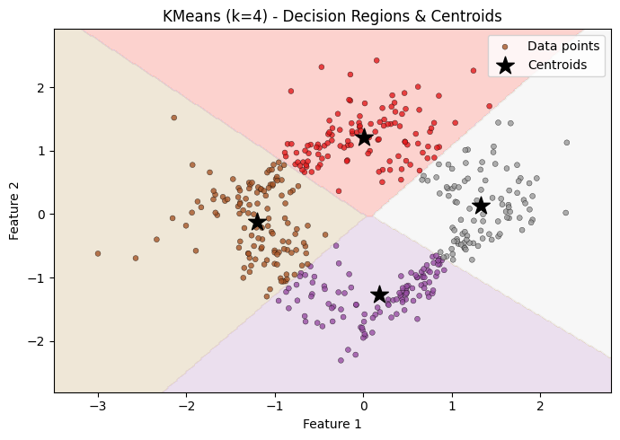
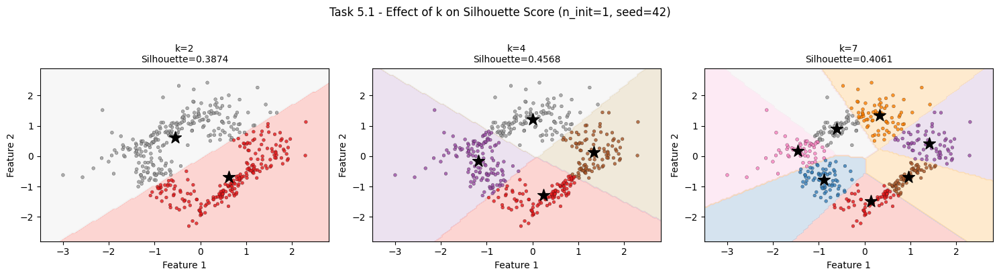
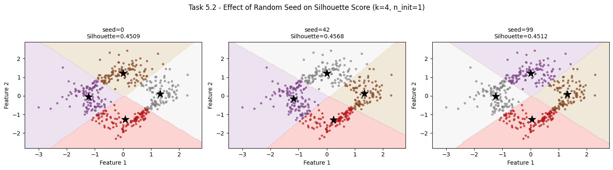

# Unsupervised Machine Learning - Analysis Report


## 1. Dataset Generation

A synthetic classification dataset was generated using `sklearn.datasets.make_classification` with the following configuration:

| Parameter | Value | Rationale |
|---|---|---|
| `n_samples` | 200–1000 (random) | Within required range |
| `n_features` | 2 | Enables 2D visualisation |
| `n_informative` | 2 | All features carry signal |
| `n_redundant` | 0 | No artificially correlated features |
| `n_classes` | **4** | Maximum with 2 informative features (see below) |
| `n_clusters_per_class` | 1 | One Gaussian blob per class |
| `flip_y` | 0.05 | 5 % label noise for realism |
| `random_state` | 42 | Reproducibility |

> **Why 4 classes and not more?**  
> `make_classification` enforces the constraint: `n_classes × n_clusters_per_class ≤ 2^n_informative`.  
> With 2 informative features that ceiling is **2² = 4**, making 4 the maximum number of separable classes when `n_clusters_per_class = 1`.



Features were standardised with `StandardScaler` before clustering. KMeans is a distance-based algorithm - without standardisation, a feature with a larger numeric range would dominate the distance calculation and bias the cluster boundaries.


## 2. KMeans Model Fitting

A baseline KMeans model was fitted with **k = 4** (matching the number of true classes).

```python
KMeans(n_clusters=4, n_init=10, random_state=42)
```

Using `n_init=10` (the default) means the algorithm runs 10 independent initialisations and keeps the solution with the lowest inertia (within-cluster sum of squared distances). This makes the result robust to unlucky centroid starts.


## 3. Decision-Region Visualisation (Meshgrid Plot)

The fitted model was visualised using a **Voronoi / decision-boundary plot**:

1. A dense grid of points (`h = 0.02` step) was generated to cover the entire feature space.
2. Every grid point was assigned a cluster label by `model.predict()`.
3. `contourf` shaded the resulting regions, one colour per cluster.
4. Actual data points were overlaid, coloured by their predicted cluster.
5. Centroids were marked with a star (★).

This makes the cluster boundaries and centroid positions directly interpretable alongside the data distribution.




## 4. Silhouette Score

The **silhouette score** quantifies how well each point fits its assigned cluster relative to the nearest alternative cluster.

For a single point *i*, the score is:

```
s(i) = (b(i) − a(i)) / max(a(i), b(i))
```

where `a(i)` is the mean intra-cluster distance and `b(i)` is the mean distance to the nearest neighbouring cluster. The overall score is the average across all points.

| Score range | Interpretation |
|---|---|
| close to **+1** | Point is well inside its cluster and far from others |
| close to **0** | Point sits on or near a cluster boundary |
| close to **−1** | Point is closer to a neighbouring cluster than its own |

```python
silhouette_score(X, kmeans.labels_)
# Baseline result (k=4, seed=42): reported in notebook output
```


## 5. Sensitivity Analysis

All experiments in this section use **`n_init=1`**. With a single initialisation, seed-level randomness is not averaged away, which deliberately exposes how much the result depends on the chosen k and the random starting positions.


### 5.1 Effect of k on the Silhouette Score

Three k-values were tested with a fixed `random_state=42`: **k ∈ {2, 4, 7}**.

| k | Relationship to true structure | Expected silhouette behaviour |
|---|---|---|
| **2** | Under-clustering - 4 true groups forced into 2 clusters | **Low.** Points from structurally different groups share a cluster. Intra-cluster distances increase, silhouette falls. |
| **4** | Matches true class count | **Highest.** The algorithm has the correct number of segments to align with the underlying distribution; intra-cluster distances are minimised without unnecessary fragmentation. |
| **7** | Over-clustering - some true groups are split | **Drops again.** Artificial boundaries cut through homogeneous regions. Cohesion increases locally, but separation decreases and interpretability is lost. |

**Key insight:** The silhouette score forms a curve with a peak near the natural cluster count. It is one of the standard heuristics - alongside the elbow method on inertia - for choosing k without ground-truth labels. Neither metric is definitive on its own; combining both gives a more confident decision.




### 5.2 Effect of Random Seed on the Silhouette Score

Three seeds were tested with fixed **k = 4** and `n_init=1`: **seeds ∈ {0, 42, 99}**.

KMeans with `k-means++` initialisation places the first centroid uniformly at random, then places subsequent centroids with probability proportional to their squared distance from the nearest already-chosen centroid. Even with `k-means++`, the outcome with `n_init=1` depends on which point is selected as the first centroid - controlled entirely by the random seed.

| Scenario | Mechanism | Expected outcome |
|---|---|---|
| **Favourable seed** | All centroids start near distinct true cluster centres | Algorithm converges quickly to a near-optimal solution → **high silhouette** |
| **Unfavourable seed** | Two or more centroids start inside the same true cluster | The algorithm converges to a local minimum where one true cluster is split and another is merged → **lower silhouette** |

**Practical implication:** The spread in silhouette scores across seeds (with `n_init=1`) reveals how sensitive the dataset is to initialisation. A small spread means the clusters are well-separated - most seeds lead to the same solution. A large spread means the cluster structure is ambiguous or the classes overlap significantly.

The production default of `n_init=10` (or higher) addresses this by selecting the best result from multiple runs, making the final clustering robust to any single bad seed.




## Summary

| Parameter varied | Type of effect | Impact on silhouette |
|---|---|---|
| **k (number of clusters)** | Structural | Too few → groups merged, score drops. Too many → groups fragmented, score drops. Peak ≈ natural cluster count. |
| **Random seed (initialisation)** | Stochastic | With `n_init=1`, bad seeds trap the model in local optima. Variance across seeds measures how ambiguous the cluster structure is. |

Together, these two investigations illustrate the two main sources of instability in KMeans: the **model complexity** (k) and the **optimisation landscape** (initialisation). In practice, both are addressed systematically - k by validation metrics, initialisation by `n_init > 1`.
